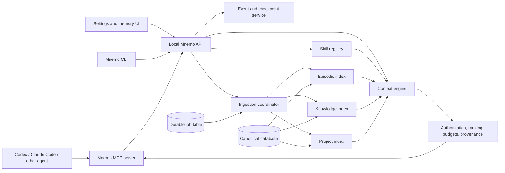

# Mnemo Unified Memory — Codex Implementation Plan

**Status:** Build-ready plan, revision 2  
**Target:** Personal, local-first product first; team workspaces later  
**Primary client:** Coding agents, beginning with Codex and Claude Code  
**Last reviewed:** 2026-08-02

## 1. Executive recommendation

Build Mnemo as a standalone **unified context platform**, not as a feature embedded inside one agent.

The installed product should feel like one system, while its internal modules remain separated:

1. **Working memory** — bounded context for the current task.
2. **Episodic memory** — prior agent actions, decisions, failures, outcomes, and checkpoints.
3. **Personal and team knowledge** — notes, meetings, documents, architecture decisions, and Obsidian vaults.
4. **Project intelligence** — repository symbols, dependencies, dbt lineage, schemas, and code relationships.
5. **Procedural memory** — skills, agents, frontmatter, policies, and repeatable workflows.
6. **Context engine** — selects a small, relevant, authorized context packet for an agent.

The product boundary is one CLI, one settings interface, one API, and one MCP integration. The storage and retrieval strategies remain type-specific. Mnemo owns its domain model, context protocol, retrieval orchestration, checkpoint format, integrations, settings experience, and product roadmap.

Do not begin by building a general knowledge graph, a multi-agent framework, a cloud service, or feature parity with another memory product. Begin with one complete local vertical slice: connect Codex and Claude Code through MCP, capture a coding-task checkpoint, parse a dbt manifest, retrieve both in a fresh session, and explain every retrieved item.

### 1.1 Ownership and clean-room policy

Mnemo is an independently designed and implemented product.

- Do not copy source code, prompts, schemas, migrations, UI, tests, documentation, or internal data formats from TencentDB Agent Memory or another competing memory product.
- Do not make a competing product a runtime, build-time, or test dependency.
- Do not require a competitor evaluation before Mnemo implementation can proceed.
- Public product behavior may inform requirements only at the capability level; Mnemo's design decisions must be justified by its own product contract, threat model, benchmarks, and user workflows.
- Preserve an architecture decision record for every foundational design choice.
- Record the author, license, version, source URL, and purpose of every third-party dependency.
- Prefer permissive, well-maintained infrastructure libraries with replaceable interfaces.
- Run software-composition analysis, dependency license checks, secret scanning, and provenance checks in CI.
- Require contributor sign-off that submitted code is original or properly licensed.

Owning Mnemo does not mean recreating databases, cryptography, parsers, protocols, or model SDKs. Mnemo may use standard open-source infrastructure while retaining ownership of the differentiating application code and product behavior.

## 2. Product promise

Mnemo should make this workflow possible:

```text
1. Install Mnemo.
2. Add a repository, dbt project, and optional Obsidian vault.
3. Connect Codex or Claude Code through MCP.
4. Work normally in fresh agent sessions.
5. Mnemo records permitted task events and creates a compact checkpoint.
6. A future session asks Mnemo for relevant context.
7. Mnemo returns only the useful memories, knowledge, dependencies, and skills.
8. The user can inspect why each item was remembered and delete or correct it.
```

Mnemo does not replace the current context window. It reduces dependence on resuming long conversations by reconstructing a smaller task-specific context package.

## 3. Definition of the first successful release

Version 1 is successful when a single user can:

- Install and start Mnemo with one command.
- Open a local settings UI.
- Register multiple projects and scopes.
- Connect Codex and Claude Code through a local MCP server.
- Save and resume agent task checkpoints without replaying the complete transcript.
- Import and incrementally synchronize Markdown or an Obsidian vault.
- Import `manifest.json` from a dbt project and answer upstream/downstream lineage questions.
- Register agents and skills defined with version-controlled frontmatter.
- Receive a token-budgeted context packet with provenance.
- View, correct, pin, expire, export, and delete memories.
- Run without an OpenAI API key when all LLM-assisted extraction is disabled.
- Configure the model provider and model used for each optional LLM task.

Team sharing, hosted sync, enterprise connectors, and a general code knowledge graph are later releases.

## 4. Architecture



### 4.1 Deployment profiles

Use a storage interface with two supported profiles, not two unrelated products.

| Profile | Purpose | Storage | Process model |
|---|---|---|---|
| Personal | Default local installation | SQLite + FTS5; embeddings stored locally and searched in-process at personal scale | API, MCP, UI, and durable worker launched by one supervisor |
| Team | Shared hosted workspace | PostgreSQL + pgvector with row-level security | Stateless API/MCP plus separate durable workers |

SQLite is acceptable only for a single-user profile. Team mode must not be released on SQLite. Both backends must pass the same repository contract tests, and the export format must migrate a personal workspace into PostgreSQL without losing IDs, revisions, provenance, or deletion state.

### 4.2 Recommended implementation stack

- **Backend and CLI:** Python 3.12, FastAPI, Pydantic, SQLAlchemy, Alembic, Typer.
- **Local canonical store:** SQLite with WAL and FTS5.
- **Team canonical store:** PostgreSQL with pgvector and row-level security.
- **Durable local jobs:** database-backed outbox/job table; do not add Redis for personal mode.
- **Team workers:** the same job contracts executed by horizontally scalable workers.
- **MCP:** official Python MCP SDK; stdio locally, streamable HTTP with OAuth for team mode.
- **UI:** React + TypeScript + Vite, served by the local API; add a desktop wrapper only after the browser UI is stable.
- **Repository parsing:** Tree-sitter adapters by language.
- **dbt:** treat dbt `manifest.json` and `catalog.json` as authoritative structured inputs.
- **Observability:** structured logs, OpenTelemetry traces, Prometheus-compatible metrics.
- **Packaging:** `uv tool install`/`pipx` first, signed native installers after the core workflow is stable, containers for team deployment.

## 5. Repository structure

```text
mnemo/
├── AGENTS.md
├── README.md
├── pyproject.toml
├── package.json
├── .codex/
│   ├── config.toml
│   └── skills/
├── apps/
│   ├── api/
│   ├── cli/
│   ├── mcp/
│   ├── worker/
│   └── web/
├── packages/
│   ├── domain/
│   ├── storage/
│   ├── context_engine/
│   ├── episodic/
│   ├── knowledge/
│   ├── project_index/
│   ├── skills_registry/
│   ├── model_gateway/
│   ├── policy/
│   └── telemetry/
├── connectors/
│   ├── codex/
│   ├── claude_code/
│   ├── filesystem/
│   ├── obsidian/
│   ├── dbt/
│   └── git/
├── schemas/
├── migrations/
├── tests/
│   ├── unit/
│   ├── contract/
│   ├── integration/
│   ├── security/
│   ├── evals/
│   └── fixtures/
└── deploy/
    ├── local/
    └── team/
```

Keep the domain package independent of FastAPI, MCP, database drivers, and model SDKs. This makes policy, retrieval, and storage behavior testable without external services.

## 6. Canonical contracts to define before feature work

### 6.1 Scope

Every stored and retrieved item must have:

```text
owner_id
workspace_id (nullable in personal mode)
project_id (nullable)
source_id
visibility
sensitivity
retention_policy
created_at / observed_at / valid_from / valid_to
```

Authorization filters run before vector or lexical ranking. Never retrieve broadly and filter afterward.

### 6.2 Evidence-bearing memory

Every durable memory needs:

```text
memory_id
memory_type
claim or structured value
status: candidate | active | superseded | retracted | expired
confidence
source trust class
evidence references
extractor version
model and prompt version when an LLM participated
revision chain
```

An assistant statement cannot become a user fact without supporting user-authored or verified evidence.

### 6.3 Context packet

The context engine returns data rather than an opaque paragraph:

```json
{
  "request_id": "uuid",
  "scope": {"project_id": "uuid"},
  "task_checkpoint": {},
  "episodic_memories": [],
  "knowledge_items": [],
  "project_facts": [],
  "skills": [],
  "conflicts": [],
  "omissions": [],
  "token_estimate": 0,
  "provenance": []
}
```

The MCP layer can additionally render this structure into agent-readable text, but the structured representation remains canonical.

### 6.4 Source authority

Use an explicit default order:

1. Current repository, dbt artifacts, and verified tool results for current structural state.
2. User corrections and pinned facts.
3. User-authored documents and statements.
4. Approved agent checkpoints and extracted episodes.
5. External documents.
6. Assistant inference.

When two sources disagree, return the conflict instead of silently picking whichever vector result ranked higher.

## 7. Model strategy: save cost without sacrificing correctness

### 7.1 First principle

Use deterministic software whenever the output can be computed.

Do **not** call an LLM for:

- Authentication or authorization.
- Secret detection as the only control.
- Retention and deletion policy.
- Hashing, deduplication, timestamps, or version comparison.
- dbt lineage extraction from the manifest.
- Tree-sitter parsing and symbol edges.
- Lexical search, vector similarity, recency decay, or token counting.
- Applying database mutations.
- Deciding whether a user has access to a memory.

### 7.2 Codex models used to build Mnemo

Current Codex guidance divides GPT-5.6 into Sol for complex, open-ended work, Terra as the everyday workhorse, and Luna for clear, repeatable work. Use the lowest reasoning effort that passes the milestone's tests.

| Development task | Model | Effort | Why |
|---|---|---:|---|
| Routine feature implementation, API endpoints, refactors, and integration tests | `gpt-5.6-terra` | medium | Default balance of reasoning and cost |
| Narrow bug fixes with a failing test, mechanical migrations, fixtures, documentation, generated client types | `gpt-5.6-luna` | low or medium | Clear outcome and high repeatability |
| Architecture decisions, schema evolution, authorization, concurrency, deletion correctness, retrieval design | `gpt-5.6-sol` | high | High-impact work with interacting constraints |
| Difficult production incident or cross-module bug after Terra fails | `gpt-5.6-sol` | high or xhigh | Escalation, not the default |
| Final milestone review and threat-model review | `gpt-5.6-sol` | high | Independent high-value verification |

Default repository configuration:

```toml
model = "gpt-5.6-terra"
model_reasoning_effort = "medium"
```

Override it per task instead of leaving the repository on the most expensive model:

```bash
codex --model gpt-5.6-luna
codex --model gpt-5.6-sol
```

Do not use a weaker model to design or approve security boundaries. Do not use Sol to generate repetitive fixtures or documentation.

### 7.3 Models used inside Mnemo at runtime

All model IDs must be configuration, not domain constants. Store the provider, model, prompt version, token usage, latency, and result status for every call.

| Runtime task | Default | Escalation |
|---|---|---|
| Query intent classification | Luna, low effort, strict schema | Deterministic fallback or Terra after one schema failure |
| Candidate episodic-memory extraction | Luna, low effort, strict schema | Terra only for ambiguous evidence |
| Short task checkpoint draft | Luna, low effort | Terra when a complex multi-step task cannot be represented correctly |
| Note metadata, tags, and entity candidates | Luna, low effort | No escalation by default |
| Contradiction analysis and multi-source consolidation | Terra, medium | Sol only in offline review; never silently resolve a user-visible conflict |
| Context compression when deterministic selection cannot fit the budget | Terra, low or medium | Return fewer sources rather than repeatedly escalating |
| Retrieval embeddings | `text-embedding-3-small` initially | Evaluate `text-embedding-3-large` only if measured retrieval quality justifies it |
| Authorization, policy, deletion, and structural parsing | No model | No model |

Model output is always a proposal validated against a strict schema. Deterministic code authorizes and applies any memory mutation.

### 7.4 Routing safeguards

- One retry maximum for invalid structured output.
- Escalate Luna to Terra only after a recorded failure or low-confidence condition.
- Sol is disabled on the synchronous retrieval path by default.
- Background consolidation and evaluation may use Batch or lower-priority processing.
- Each task type has daily call, input-token, output-token, and monetary budgets.
- A circuit breaker disables optional LLM processing while preserving deterministic ingestion and retrieval.
- Users can select local or third-party model providers through the same gateway.

### 7.5 What actually saves tokens

Choosing Luna instead of Terra mainly reduces **cost per token**. Mnemo reduces **token count** through retrieval and context controls:

- Start fresh sessions with a checkpoint rather than replaying full transcripts.
- Retrieve from each memory category only when the query requires it.
- Fetch metadata and summaries first; fetch full source content only on demand.
- Enforce a hard context-packet budget.
- Prefer dbt and syntax relationships over reading unrelated source files.
- Deduplicate repeated facts and collapse superseded revisions.
- Store compact checkpoints separately from raw events.
- Limit outputs from extraction and consolidation jobs.
- Measure tokens retrieved, tokens sent, cached input tokens, and useful citations per answer.

Recommended initial context budget:

| Section | Default maximum |
|---|---:|
| Active task checkpoint | 600 tokens |
| Episodic memories | 800 tokens |
| Personal/project knowledge | 1,200 tokens |
| Structural project facts and code excerpts | 1,500 tokens |
| Skills and mandatory procedures | 1,200 tokens |
| Provenance and conflict notices | 400 tokens |
| **Total hard default** | **5,700 tokens** |

Allow project-level configuration, but require an explicit override above 8,000 retrieved tokens. Never fill a budget merely because space remains.

For repeated API prompts, put stable instructions and schemas before variable user and memory content. OpenAI prompt caching works on matching prompt prefixes; treat caching as an additional cost/latency optimization, not as durable memory.

## 8. Implementation milestones

Each milestone must end in a working vertical slice, tests, a migration, metrics, and updated documentation. Codex should receive one bounded issue at a time.

### Milestone 0 — Ownership foundation, product contract, and eval baseline

**Build**

- Create the product ownership policy, third-party dependency register, contribution provenance rules, and architecture decision record template.
- Write the memory taxonomy, source authority, consent model, prohibited data policy, and retention defaults.
- Define ten representative dbt/coding workflows and their expected retrieved evidence.
- Create a no-memory baseline and a full-transcript baseline.
- Define the context packet JSON Schema and MCP tool inventory.
- Create the initial threat model: cross-project disclosure, prompt injection in notes, poisoned memories, secrets, stale code state, and deletion propagation.

**Exit gate**

- Product contract and schemas are version controlled.
- At least 50 golden retrieval questions exist across the four memory categories.
- Every item has an expected source and scope.
- Every initial dependency has a recorded license, version, source, owner, and replacement boundary.
- CI rejects dependencies with an unapproved license and checks committed source provenance.
- No feature work begins until the cross-scope authorization rules are unambiguous.

**Codex model:** Sol/high for the initial design; Terra/medium for fixtures and documentation.

### Milestone 1 — Repository, domain kernel, and minimal MCP path

**Build**

- Initialize the monorepo, CI, formatting, static typing, and test layers.
- Copy this revision-controlled plan into `docs/implementation-plan.md` and create `docs/implementation-status.md`; the repository copies become the durable build record.
- Add `AGENTS.md` with architecture boundaries, originality rules, dependency rules, and required verification commands.
- Implement IDs, scopes, evidence references, revision status, and the context-packet types.
- Add SQLite migrations and repository interfaces.
- Implement CLI commands: `mnemo init`, `mnemo start`, `mnemo status`, `mnemo stop`.
- Implement a local stdio MCP server with `get_context` and `save_checkpoint` using manually created fixture data.
- Add minimal connection commands: `mnemo connect codex` and `mnemo connect claude-code`.

**Exit gate**

- Fresh install to successful MCP calls from test clients is covered by automated smoke tests.
- Domain tests run without a database or network.
- Migration up/down and corrupted-config behavior are tested.
- Failed Mnemo startup does not prevent either coding agent from running normally.

**Codex model:** Terra/medium; Luna/low for scaffolding once the architecture is fixed.

### Milestone 2 — Native agent integration and checkpoint proof

**Build**

- Package the Mnemo MCP connection and task-continuity skill for Codex.
- Provide Claude Code MCP configuration and supported lifecycle hooks without proxying model traffic.
- Capture only permitted task lifecycle events required to construct a checkpoint.
- Implement explicit checkpoint creation, retrieval, revision, completion, and abandonment.
- Render one bounded, provenance-bearing context packet for a fresh session.
- Add integration failure isolation, timeouts, and read-only defaults.

**Exit gate**

- The same fixture task can be stopped and resumed in a fresh Codex session and a fresh Claude Code session.
- Resumption uses fewer input tokens than replaying the full fixture transcript.
- The context packet identifies its checkpoint source and stays within its budget.
- Mnemo never changes the client's configured model endpoint.
- Mnemo failure degrades to ordinary agent operation.

**Codex model:** Terra/medium; Sol/high for integration security review.

### Milestone 3 — dbt-native project intelligence

**Build**

- Ingest dbt `manifest.json`, `catalog.json`, and `run_results.json`.
- Model projects, packages, nodes, sources, tests, exposures, macros, metrics, columns, and typed lineage edges.
- Add deterministic upstream, downstream, path, impact, selector, freshness, and test-coverage queries.
- Record target, environment, invocation, Git commit, and working-tree fingerprints so structural state can be labeled current or stale.
- Add changed-state indexing and affected-node refresh where dbt artifacts permit it.
- Return dbt facts and minimal code excerpts through the existing context packet.

**Exit gate**

- Golden lineage answers match the dbt artifacts exactly.
- Stale indexes are labeled and never presented as current.
- Dependency questions use fewer source-file tokens than repository-search baselines.
- A fresh agent session resumes the fixture task with both its checkpoint and correct dbt impact scope.
- No LLM is used to compute authoritative dbt relationships.

**Codex model:** Terra/medium; Sol/high for the graph schema and incremental-index correctness.

### Milestone 4 — Canonical events and production episodic memory

**Build**

- Add append-only conversation, task, tool, decision, failure, outcome, and checkpoint events.
- Implement a durable transactional outbox and idempotent background jobs.
- Add deterministic secret patterns and pluggable classification before storage or embedding.
- Add optional Luna extraction into typed, evidence-bearing memory candidates.
- Add user approval and correction workflows for low-confidence or sensitive memories.
- Implement revision, supersession, expiry, retention, export, and deletion propagation.

**Exit gate**

- Replaying an event stream produces identical active projections.
- Duplicate job delivery has no duplicate effect.
- Secrets in the security corpus are neither embedded nor returned.
- Correction, export, retention, and deletion integration tests pass.
- Every active memory can be traced to permitted evidence.

**Codex model:** Terra/medium; Sol/high for idempotency, retention, and deletion review.

### Milestone 5 — Unified context engine

**Build**

- Implement query classification and a deterministic retrieval plan.
- Generate authorization-first candidates by memory category.
- Add lexical, structured, vector, temporal, and importance scoring.
- Use reciprocal-rank or another explainable fusion method.
- Add conflict detection, deduplication, diversity, and hard token budgets.
- Render context specifically for Codex and Claude Code without changing the canonical packet.
- Implement `explain_context` with sources, ranks, exclusions, conflicts, and staleness.

**Exit gate**

- Packet construction never exceeds its configured budget.
- Every included claim has provenance.
- Cross-scope leakage tests remain at zero.
- Retrieval improves task-resumption success over the no-memory baseline.
- It beats the full-transcript baseline on input tokens without material quality regression.

**Codex model:** Sol/high for ranking and conflict design; Terra/medium for implementation.

### Milestone 6 — Personal knowledge and Obsidian

**Build**

- Add filesystem and Obsidian-vault connectors for Markdown.
- Implement incremental sync with content hashes, stable source IDs, rename detection, and deletion tombstones.
- Parse frontmatter, headings, links, backlinks, chunks, and citations.
- Use FTS retrieval first and embeddings as a rebuildable projection.
- Treat document text as untrusted evidence, never instructions.
- Add knowledge-specific correction, source priority, and conflict behavior.

**Exit gate**

- Create, modify, rename, and delete sync tests pass.
- Search results cite a local source path and heading.
- Malicious instructions inside notes cannot override system or user instructions.
- Re-indexing unchanged content makes zero embedding calls.
- Relevant knowledge can join a checkpoint and dbt facts without exceeding the packet budget.

**Codex model:** Terra/medium; Luna/low for connector fixtures and schema-bound metadata.

### Milestone 7 — Procedural memory: skills and agents

**Build**

- Add skill and agent frontmatter schemas.
- Implement a versioned registry with scope, applicability, compatibility, trust, and source digest.
- Discover skills on demand rather than injecting every skill into every request.
- Keep checked-in skills authoritative over generated memory.
- Add MCP skill listing/get support where compatible with each client.
- Add import support for existing Mnemo agents and skills without changing their source files.

**Exit gate**

- Only applicable skills enter a context packet.
- Changed skills invalidate the correct cache and retain revision history.
- A remembered preference cannot override a mandatory checked-in project rule.
- Existing Mnemo frontmatter fixtures import without semantic loss.

**Codex model:** Terra/medium; Luna/low for validators and compatibility fixtures.

### Milestone 8 — Settings UI, inspection, and packaging

**Build**

- Onboarding wizard and connection health checks.
- Source, model, privacy, retention, and context-budget settings.
- Memory browser with evidence, revisions, correction, pin, export, and deletion.
- Index status, staleness, last sync, job failures, and retry controls.
- Signed release artifacts and automatic schema backup before upgrades.
- One-command install, start, upgrade, uninstall, and diagnostic bundle.

**Exit gate**

- A non-developer can install and connect a sample project from written instructions.
- Upgrade and rollback tests preserve data.
- Uninstall clearly distinguishes application removal from optional data deletion.
- Logs and diagnostic bundles redact content and secrets by default.

**Codex model:** Terra/medium; Luna/low for UI fixtures and docs; Sol/high for upgrade review.

### Milestone 9 — Team workspace and production hardening

**Build**

- PostgreSQL/pgvector backend parity and personal-to-team import.
- Workspace membership, roles, project visibility, row-level security, and audit logs.
- OAuth for remote MCP, encrypted transport, secret management, backups, restore drills, and deletion propagation.
- Rate limits, quotas, per-tenant model budgets, dashboards, alerts, and runbooks.
- Team knowledge ownership, conflicting corrections, and source approval.

**Exit gate**

- Cross-tenant security suite passes at the database and service layers.
- Restore and deletion drills meet documented objectives.
- Load test meets declared latency and throughput SLOs.
- Personal export imports into a team workspace with verified counts and hashes.
- Independent security review has no unresolved critical or high findings.

**Codex model:** Sol/high for architecture, security, migrations, and review; Terra/medium for bounded implementation tasks.

## 9. Codex operating method

### 9.1 Repository instructions

Use `AGENTS.md` for durable build rules:

- All product-specific code must be original to Mnemo or accompanied by an approved license and provenance record.
- Do not copy competing products' code, prompts, schemas, migrations, tests, or documentation.
- Domain code cannot import adapters.
- Every tenant/project query includes explicit scope.
- LLM output never directly mutates canonical data.
- Migrations require rollback or documented forward-only recovery.
- Every feature includes unit, contract, integration, and relevant security tests.
- Verification commands and formatting rules are explicit.
- Do not modify unrelated files.

Create repository skills for recurring workflows such as:

- `add-memory-type`
- `add-connector`
- `add-mcp-tool`
- `write-migration`
- `run-retrieval-eval`
- `security-review-memory-path`

### 9.2 One Codex task per bounded change

Good task:

```text
Implement the context-packet Pydantic models from schemas/context-packet.json.
Do not add persistence or API routes. Add unit tests for valid packets, invalid
provenance, token-budget overflow, and unknown fields. Run the domain test suite.
```

Poor task:

```text
Build Mnemo Memory.
```

For each issue, require Codex to:

1. Read the relevant contract and nearby code.
2. State assumptions and the acceptance test.
3. Implement the smallest complete change.
4. Run the narrow tests, then the milestone suite.
5. Review the diff for scope and security.
6. Write a compact checkpoint for the next fresh task.

Use fresh Codex tasks between bounded issues. Persist project state in Git, issue acceptance criteria, and Mnemo checkpoints rather than relying on a very long agent conversation.

### 9.3 First twelve Codex issues

1. Initialize the monorepo, CI, linters, type checks, and test commands; copy revision 2 of this plan into `docs/implementation-plan.md` and create `docs/implementation-status.md`.
2. Write `AGENTS.md`, the ownership policy, dependency register, ADR template, and architecture dependency tests.
3. Implement domain identifiers, scopes, sensitivity, retention, evidence, and checkpoint types.
4. Implement and validate the context-packet schema and hard token-budget validator.
5. Add the SQLite storage adapter, migration harness, and reusable repository contract tests.
6. Build the minimal local API and CLI lifecycle: `init`, `start`, `status`, and `stop`.
7. Build the stdio MCP server with fixture-backed `get_context` and `save_checkpoint`.
8. Implement `mnemo connect codex` and verify a read/write MCP smoke test.
9. Implement `mnemo connect claude-code` without a model proxy and verify the same smoke test.
10. Implement explicit checkpoint creation, revision, completion, abandonment, and provenance.
11. Add the cross-client fresh-session resume fixture and failure-degradation tests.
12. Ingest a dbt manifest and add deterministic upstream/downstream queries to the resumed fixture.

After Issue 12, establish the no-memory, full-transcript, and Mnemo baselines for tokens, latency, quality, and cost before adding automatic memory extraction, Obsidian, Tree-sitter, or team features.

Do not parallelize issues that touch the domain contracts or the same migrations. Parallel Codex work is appropriate later for independent connectors, UI screens, fixtures, and documentation after interfaces are stable.

## 10. Evaluation and production gates

### 10.1 Quality

- Retrieval precision and recall by category.
- Task-resumption success rate.
- Correct source citation rate.
- Stale structural-fact rate.
- Contradiction detection rate.
- User correction and deletion success.
- Answer quality compared with no-memory and full-transcript baselines.

### 10.2 Token and cost

- Raw transcript tokens available.
- Candidate tokens retrieved.
- Tokens after deduplication and budgeting.
- Final context-packet tokens.
- Cached input tokens.
- Output and reasoning tokens per model task.
- Embedding tokens per changed source.
- Cost per successful resumed task.

The key product metric is not “tokens stored.” It is:

```text
useful resumed tasks completed
--------------------------------
total retrieval + generation cost
```

### 10.3 Reliability and latency

Initial objectives, validated against a documented personal-scale fixture:

- Deterministic local context assembly p95 under 750 ms.
- MCP availability at least 99.5% while the local daemon is running.
- Context packet never exceeds the hard token budget.
- Optional extraction occurs asynchronously and adds no latency to the current answer.
- Failed indexing is visible and retryable.

Do not promise an arbitrary team SLO before load testing the PostgreSQL profile.

### 10.4 Security and privacy

- Zero cross-owner, cross-workspace, or cross-project leakage in the adversarial suite.
- Prohibited secrets are not stored or embedded.
- Prompt injection corpus cannot convert document text into instructions.
- Every read/write/delete has a scoped audit record without sensitive payloads.
- Deletion covers canonical data, projections, caches, exports, and backups according to policy.
- Memory is never used as authentication or authorization evidence.

## 11. Explicit deferrals

Defer these until the corresponding evidence justifies them:

- A dedicated graph database.
- General entity-relation extraction across all personal knowledge.
- Automatic ingestion of every screen, terminal, or conversation.
- Hosted multi-tenant SaaS.
- Real-time collaboration.
- Autonomous memory mutation without policy validation.
- Fine-tuning a model for extraction or ranking.
- A custom vector database.
- Multi-agent orchestration inside the Mnemo runtime.

PostgreSQL adjacency tables are enough for dbt and initial code edges. Introduce a graph database only after measured query complexity or scale proves that relational recursive queries are insufficient.

## 12. Go/no-go decision after the vertical slice

After Milestone 3, compare three conditions on the golden workflows:

1. Fresh session with no memory.
2. Resumed/full-transcript session.
3. Fresh session with Mnemo context.

Proceed to full product development only if Mnemo:

- materially improves task resumption over no memory;
- uses materially fewer input tokens than full transcript on long-session fixtures;
- retains the evidence needed for correct decisions;
- does not introduce unacceptable privacy or latency failures; and
- can explain why every memory was used.

This is an internal product-quality gate, not a requirement to install, test, or depend on another memory product. Mnemo succeeds by meeting its user outcomes and baselines, not by reproducing a competitor's implementation.

If it saves money but reduces task quality, improve retrieval before adding more connectors. If it improves quality but does not save tokens, tighten summaries and budgets. If it cannot maintain scope isolation, stop team development until authorization is redesigned.

## 13. Recommended starting point

Start with Issue 1 to create the version-controlled repository, then complete the Milestone 0 ownership, product-contract, threat-model, and evaluation artifacts through Issue 2 before implementing domain features. Continue through Issues 3–12. Do not begin with the settings UI, Obsidian, automatic skill generation, general CodeGraph, or team hosting. The first technical proof should demonstrate this exact path:

```text
Codex or Claude Code task
    -> explicit compact checkpoint
    -> local storage
    -> MCP get_context
    -> fresh Codex or Claude Code session
    -> checkpoint plus dbt dependency facts
    -> resumed task with provenance and fewer tokens than full transcript
```

After this proof passes, harden canonical events and episodic memory, then build the unified context engine. Add one Markdown architecture decision only after checkpoints and dbt retrieval work reliably. That is the smallest independently owned demonstration of Mnemo's differentiated value.

## 14. Current official guidance used for model routing

- [OpenAI API model catalog](https://developers.openai.com/api/docs/models) — Sol for complex reasoning and coding, Terra for balance, and Luna for cost-sensitive high-volume work.
- [OpenAI cost optimization guide](https://developers.openai.com/api/docs/guides/cost-optimization) — reduce requests, minimize tokens, select smaller models, and use asynchronous processing where suitable.
- [OpenAI prompt caching guide](https://developers.openai.com/api/docs/guides/prompt-caching) — structure stable prompt prefixes before variable content and monitor cached-token behavior.
- [OpenAI embeddings guide](https://developers.openai.com/api/docs/guides/embeddings) — `text-embedding-3-small` is the cost-oriented initial embedding option; evaluate retrieval quality rather than assuming the larger model is necessary.
- [Codex MCP server guidance](https://developers.openai.com/plugins/build/mcp-server) — use focused, schema-defined tools with authorization and accurate safety annotations.
- [Codex plugin guidance](https://developers.openai.com/plugins/build/plugins) — package related skills and the Mnemo MCP connection as an installable capability.

Model availability and prices can change. Keep the router configurable and re-run the model eval matrix before changing defaults.
